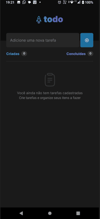

# Todo-Mobile  

Mobile application for organizing tasks where the user can add and delete tasks and mark them as completed. 
 
## Features

- Add new tasks with descriptions.
- Mark tasks as completed.
- Remove tasks from the list.
- Persistent storage of tasks and their completion status.



## Technologies 
 
Developed in:
- Typescript
- With React-Native
- Using Expo template
- Managed environment
  
### Requirements
- node
- expo
- expo go (to run locally)
  
 
## Instalação  
Install the necessary dependencies after cloning this repository:
Clone this repository to your local machine:
```bash
git clone https://github.com/your-username/goaltrackapp.git     
  
npm install 
```

## Expo go (baixar e instalar em um android)
Download it on your mobile device to scan the QR code displayed in the terminal to run the app on your device.  
  
### Development 
To run the project locally run (expo start) using the command:

 
```npm start```
 
You can also test this mobile application in a running web browser:
```npm start --web```

### Usage

Launch the app on your mobile device.
Add tasks by entering their descriptions and tapping the "+" button.
Mark tasks as completed by tapping the checkbox icon.
Remove tasks by tapping the trash icon.

## Estrutura

```
- root
  - assets
    - fonts
    - images
  - src
    - components
      - AddTask
      - EmptyTask
      - Header
      - TaskCard
      - TaskCounter
    - context
    - screens
      - Home
    - themes
  - App.tsx
  - app.json
  - babel.config.js
  - package.json
  - tscongif.json
  
```
  
## Dependências

```
"dependencies": {
    "expo": "~49.0.12",
    "expo-status-bar": "~1.6.0",
    "react": "18.2.0",
    "react-dom": "^18.2.0",
    "react-native": "0.72.5",
    "react-native-elements": "^3.4.3"
  },
  
  ```

